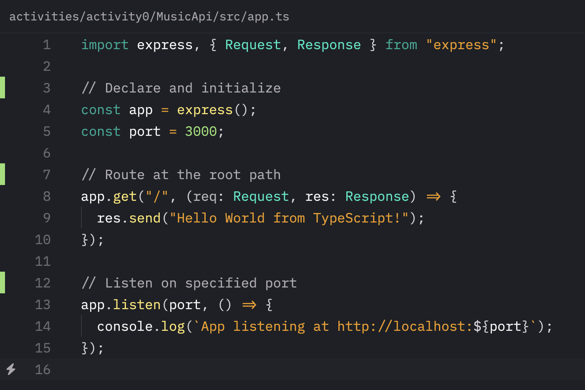

# Activity 0

*Screenshot 1: `node -v` & `npm -v`*

---

*Screenshot 2: Hello World console appplication*

---

*Screenshot 3: Hello World in the browser*

---

*Screenshot 4: Hello World in the browser with nodemon utility*

---

*Screenshot 5: Hello World TypeScript in the browser*

---

*Screenshot 6: Commented app.ts*
