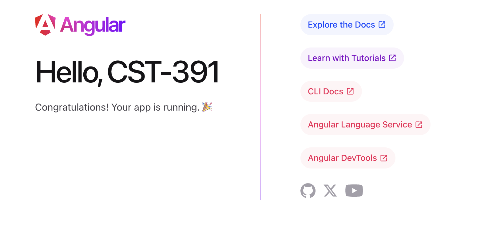

# Activity 2

## Screenshots

*Screenshot 1: `ng version` output*

---

*Screenshot 2: Angular app running*

---

*Screenshot 2: Angular app running with title modified*

---

*Screenshot 2: Angular app running with message rendered*

---

## Research

### Question 1
- `node_modules`: The node modules directory is where all the external dependencies for the project are stored locally. This directory is generated when `npm-install` is run.
- `src`: This directory is where all of the source code for the app goes.[^1]
- `src/app`: This directory contains all of the component files needed to render the app[^1]
- `src/assets`: This directory contains static assets for the project, like images and text files.
- `src/environments`: This folder contains environment-specific configuration files.[^2]
- `angular.json`: This file stores the configuration for angular CLI.[^1]
- `package.json`: This file contains the npm dependency information for the project.[^1]
- `tsconfig.json`: This file contains the TypeScript configuration information for the project.[^1]

[^1]: https://angular.dev/reference/configs/file-structure
[^2]: https://angular.dev/tools/cli/environments

### Question 2
The source of the default Angular test page is rendered by the Angular framework, like all pages made with Angular. While the browser sees a singular HTML page, behind the scenes Angular is working with many different moving pats that allow it to generate the final page.
- The main.ts file is the main entry point for the application. This is the file that node runs when the app is started.
- app.component.css defines the styling for the root component of the app
- app.component.ts is the root component of the application, containing the rest of the application's parts.
