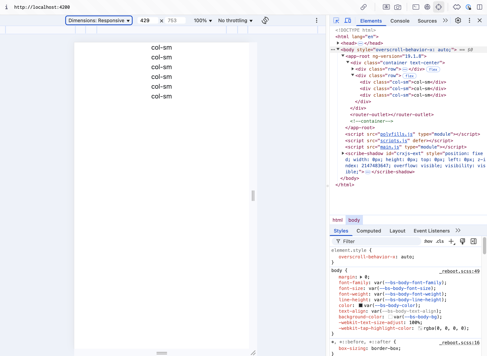
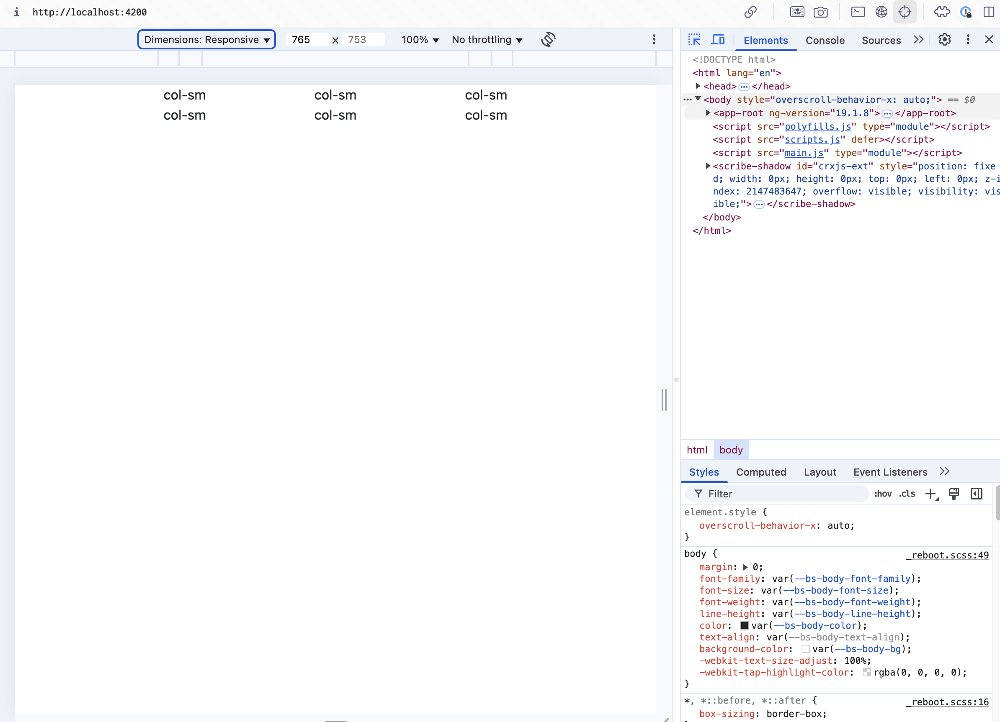
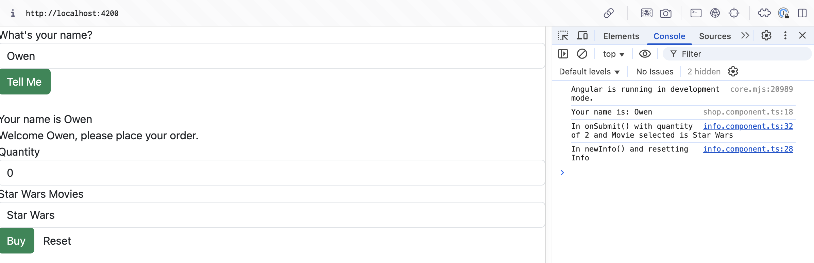

# Activity 3

## Summary

## Screenshots

### Part 1

*Screenshot 1: BS Grid on small screen*

---

*Screenshot 2: BS Grid on large screen*

---

*Screenshot 3: Form console output*

---

*Screenshot 4: Form before name is entered*

---

*Screenshot 5: Form after name is entered*

---

## Research

### Part 1

#### Question 1
The `@Input()` decorator in InfoComponent enables the component to 
receive external data from its parent, making it reusable and flexible 
in different contexts.

#### Question 2
The `[value]` attribute in the `<option>` tag assigns the value of each 
dropdown option. This allows the `<select>` element to work with the data 
model, making sure that the selected value is reflected in the component.

#### Question 3
The `[(ngModel)]` attribute enables two-way data binding between form elements 
and component properties, ensuring real-time synchronization between the UI and 
the component's data.

