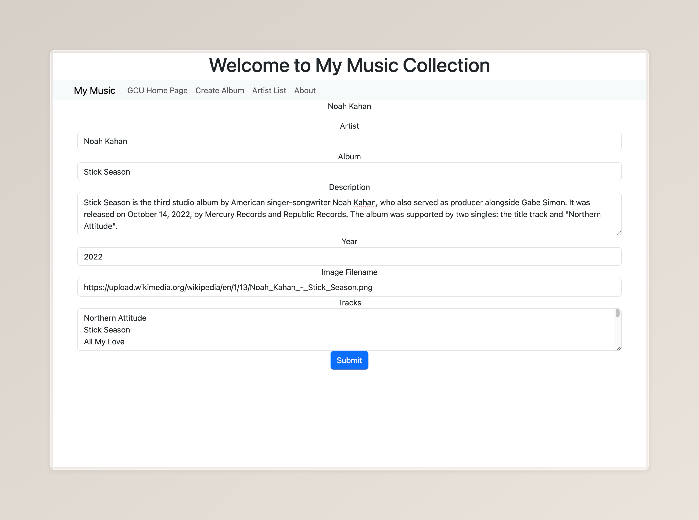
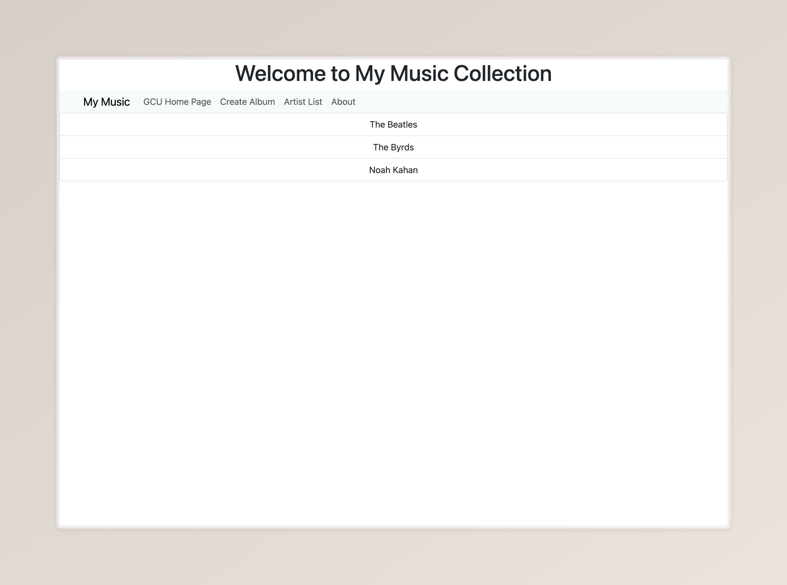
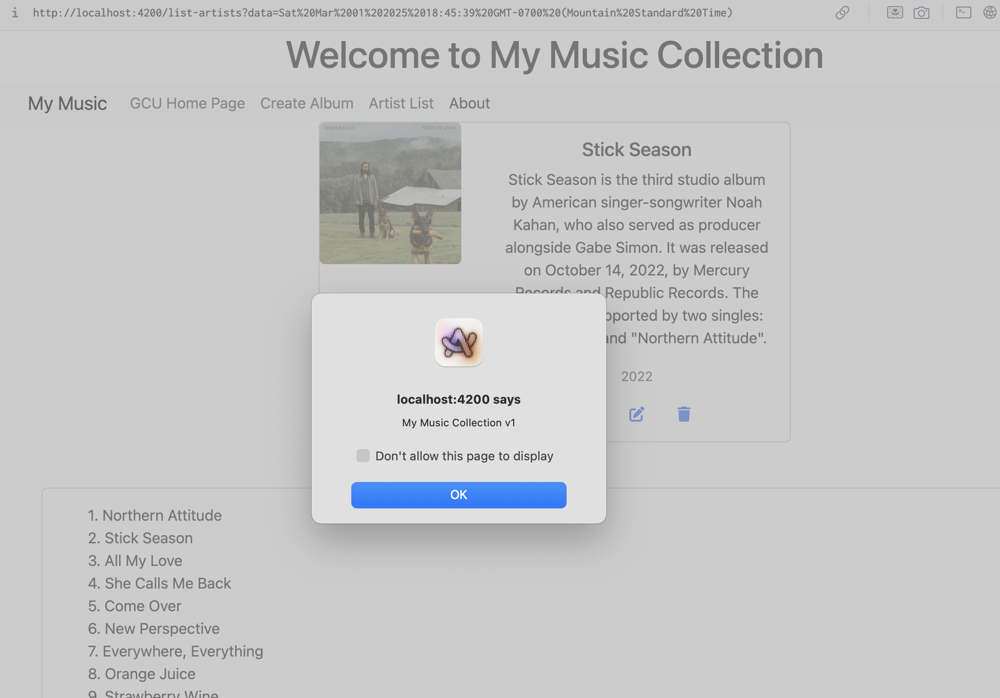

# Activity 3

## Summary
In this activity, I created an Angular application that implements multiple components, 
handles page events, and binds data to a view template.

## Screenshots

### Part 1


*Screenshot 1: BS Grid on small screen*

---


*Screenshot 2: BS Grid on large screen*

---


*Screenshot 3: Form console output*

---


*Screenshot 4: Form before name is entered*

---


*Screenshot 5: Form after name is entered*

---

### Part 2


*Screenshot 6: Application homepage*

---


*Screenshot 7: GCU homepage*

---



*Screenshot 8: Create album page*

---



*Screenshot 9: Artist list*

---


*Screenshot 10: Album list*

---


*Screenshot 11: Album details*

---



*Screenshot 12: About box*

---

## Research

### Part 1

#### Question 1
The `@Input()` decorator in InfoComponent enables the component to 
receive external data from its parent, making it reusable and flexible 
in different contexts.

#### Question 2
The `[value]` attribute in the `<option>` tag assigns the value of each 
dropdown option. This allows the `<select>` element to work with the data 
model, making sure that the selected value is reflected in the component.

#### Question 3
The `[(ngModel)]` attribute enables two-way data binding between form elements 
and component properties, ensuring real-time synchronization between the UI and 
the component's data.

### Part 2

#### Question 1
```typescript
import { Injectable } from '@angular/core';
import exampledata from '../../data/sample-music-data.json';
import { Artist } from './../models/artists.model';
import { Album } from '../models/albums.model';

@Injectable({
  providedIn: 'root'
})

/**
 * Music service class
 */
export class MusicServiceService {

  albums: Album[] = exampledata;

    /**
     * Get all artists
     */
  public getArtists(): Artist[] {
    let artists: Artist[] = [];
    let artistSet = new Set<string>();

    // Get artists from list of albums
    this.albums.forEach(a => artistSet.add(a.artist));

    // Add artists to list of artists
    artistSet.forEach(a => artists.push({artist: a}))
    return artists;
  }

    /**
     * Get all albums
     */
  public getAlbums(): Album[] {
    // Return the list of Albums
    return this.albums;
  }

    /**
     * Get albums by artist
     * @param artistName Name of artist to get albums from
     */
  public getAlbumsOfArtist(artistName: String): Album[] {

    let albums: Album[] = [];

    // Iterate over all albums
    this.albums.forEach(album => {
      // Push matching albums to album array  
      if (album.artist == artistName) {
        albums.push(album);
      }
    });
    return albums;

  }

    /**
     * Create album
     * @param album Album to be created
     */
  public createAlbum(album: Album): number {
    // Add a new Album to the list of Albums
    this.albums.push(album);
    return 1;
  }

    /**
     * Update album
     * @param album album to be updated
     */
  public updateAlbum(album: Album): number {
    // Search for the Album in the list of Albums and replace it in the list
    for (let i = 0; i < this.albums.length; ++i) {
      if (this.albums[i].albumId == album.albumId) {
        this.albums.splice(i, 1, album);
        return 0;
      }
    }
    return -1;
  }

    /**
     * Delete album
     * @param id ID of album to be deleted
     */
  public deleteAlbum(id: number): number {
    // Search for the Album in the list of Albums and delete from the list
    for (let i = 0; i < this.albums.length; ++i) {
      if (this.albums[i].albumId == id) {
        this.albums.splice(i, 1);
        return 0;
      }
    }
    return -1;
  }
}

```

