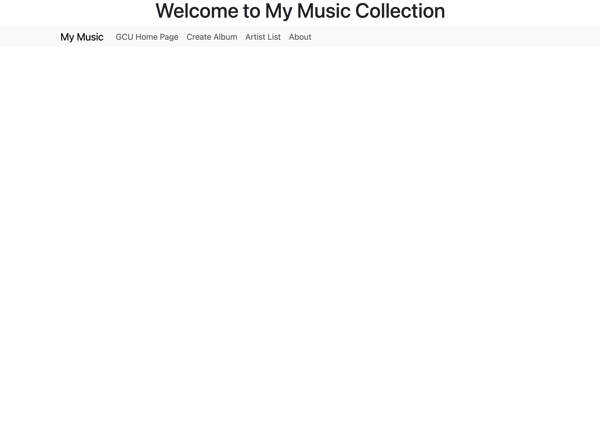
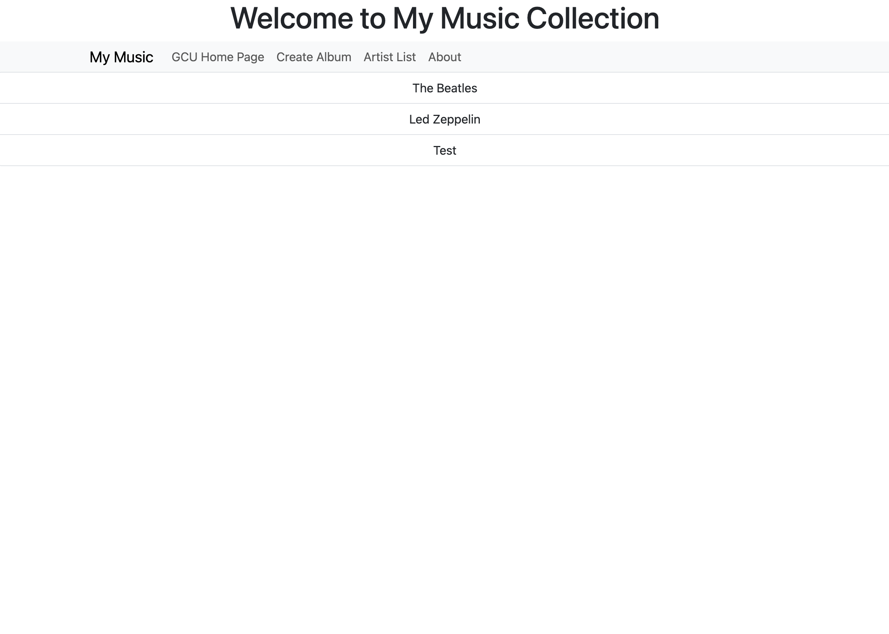
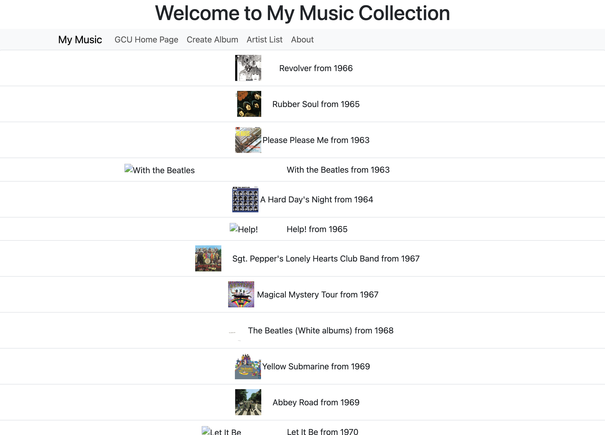
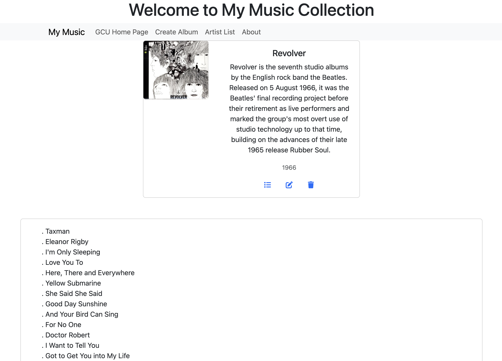
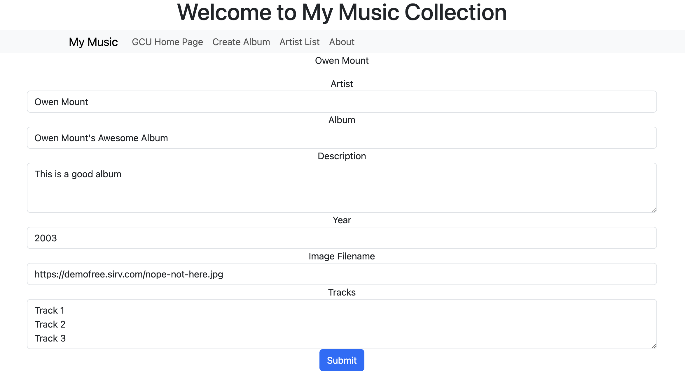
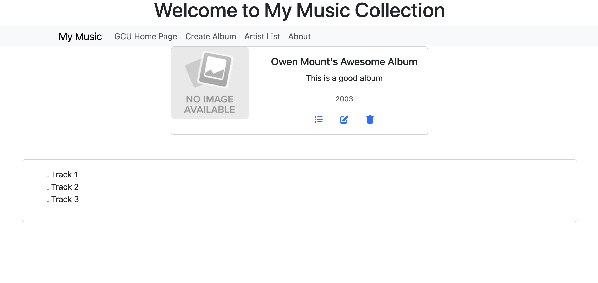

# Activity 4

## Summary
In this activity, I created an Angular application that implements multiple components, 
handles page events, and binds data to a view template.

## Screenshots

*Screenshot 1: Main page*
---

*Screenshot 2: Artist list*
---

*Screenshot 3: Album list*
---

*Screenshot 4: Album details*
---

*Screenshot 5: Create album*
---

*Screenshot 1: Create album result*
---

## Research

### Question 1
An Angular application maintains a logged-in state using tokens, typically JSON Web Tokens (JWT). 
When a user logs in, the server generates a token and sends it back to the client. The Angular 
app stores this token in local storage or session storage. For each request to the server 
(like fetching user data), the app includes the token in the Authorization header using an HTTP 
interceptor. The server verifies the token to confirm the user's identity and permissions. If 
the token is valid, the request is processed; if not, the server may respond with an error 
(like 401 Unauthorized), prompting the app to log the user out or refresh the token if supported. 
This setup allows the app to stay logged in even after a page refresh, as long as the token remains 
valid.
