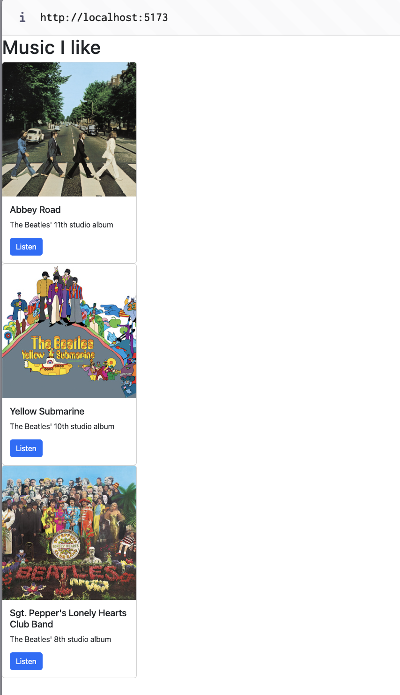
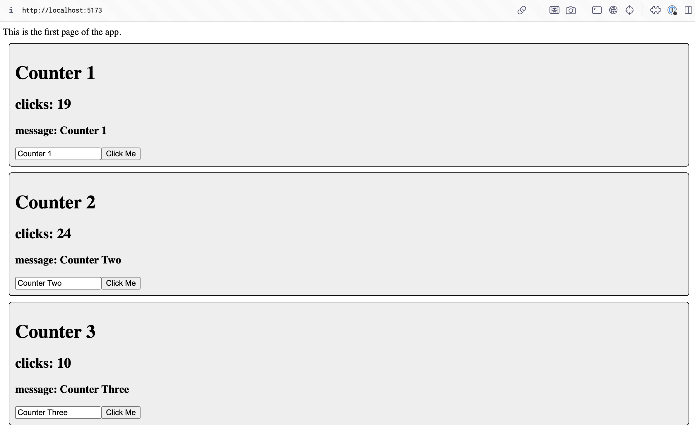

# Activity 5

## Stopping Point 1

### Summary

At this point, I've added custom App and Card components to the app. I've also added properties to the Card component to allow dynamic display.

### Screenshots

*Screenshot 1: Application running with custom card components*

---

## State Changer Mini App

### Summary

I created components that use useState to dynamically modify fields in the component based on user input.

### Screenshots

*Screenshot 1: Application running with state change components*

---
