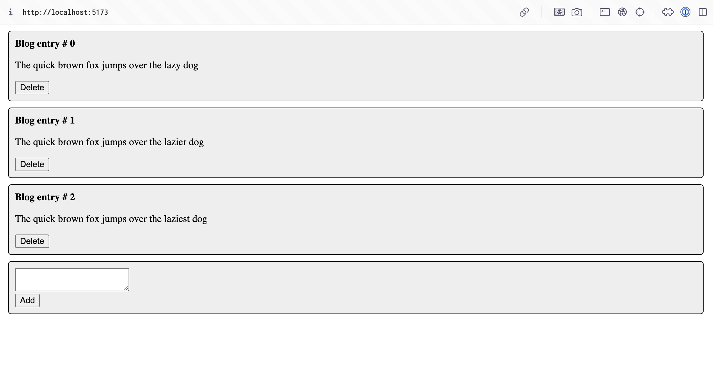
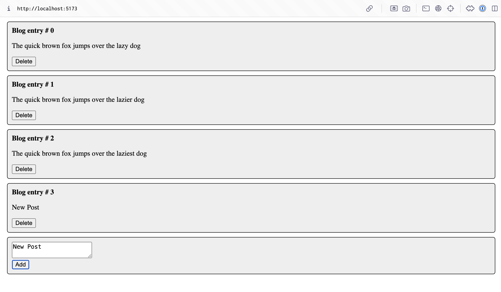
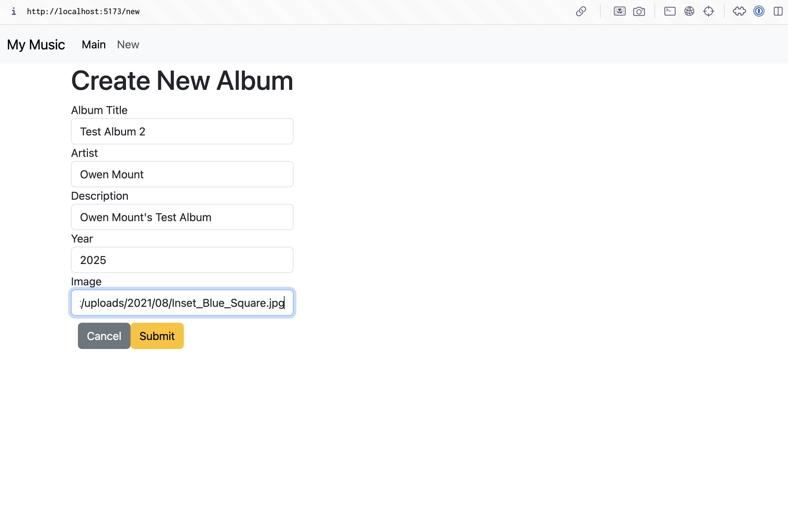
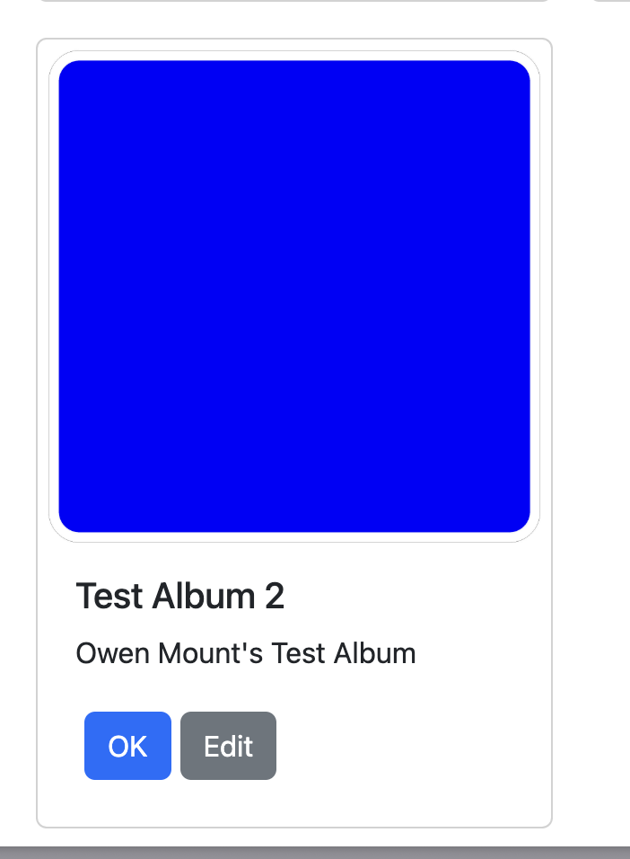
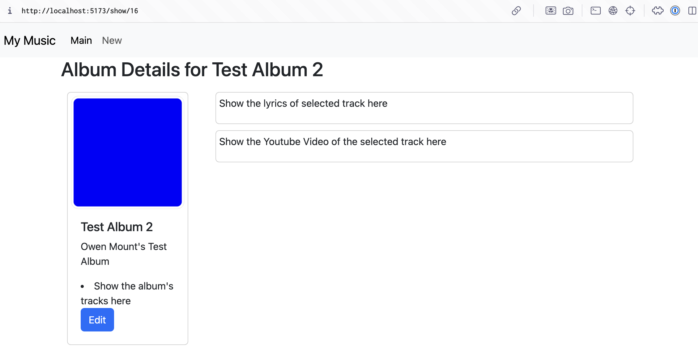
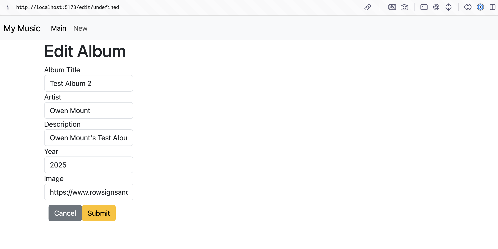

# Activity 7

## Mini App 3

### Screenshots

*Screenshot 1: Blog Post List*

*Screenshot 2: New Post*

## Stopping Point 5

### Summary
The app above taught me to implement dynamic and interative components in React. The guide said that implementing these in the project was optional, and I chose not to.

## Stopping Point 6

### Summary

This part of the guide taught me how to implement the Create part of the CRUD process in React. I added the ability to create a new album and persist it in the data layer. The input was collected using a controlled component in react. This allowed HTML form inputs and javascript data to be coupled

### Screenshots

*Screenshot 3: Create album*

*Screenshot 4: New album*

*Screenshot 5: Display album*

## Stopping Point 7

### Summary
I modified the NewAlbum component to also handle editing by renaming it to EditAlbum and updating the logic to distinguish between creating and editing albums based on props. I adjusted the form submission to differentiate between create and edit requests. In App.js, I replaced the onNewAlbum callback with onEditAlbum and used updateSingleAlbum to handle the "show" or "edit" path. I also added an edit button in AlbumList and updated Card.js with proper URIs for both actions, streamlining the app's handling of albums.

### Screenshots

*Screenshot 6: Edit album*
