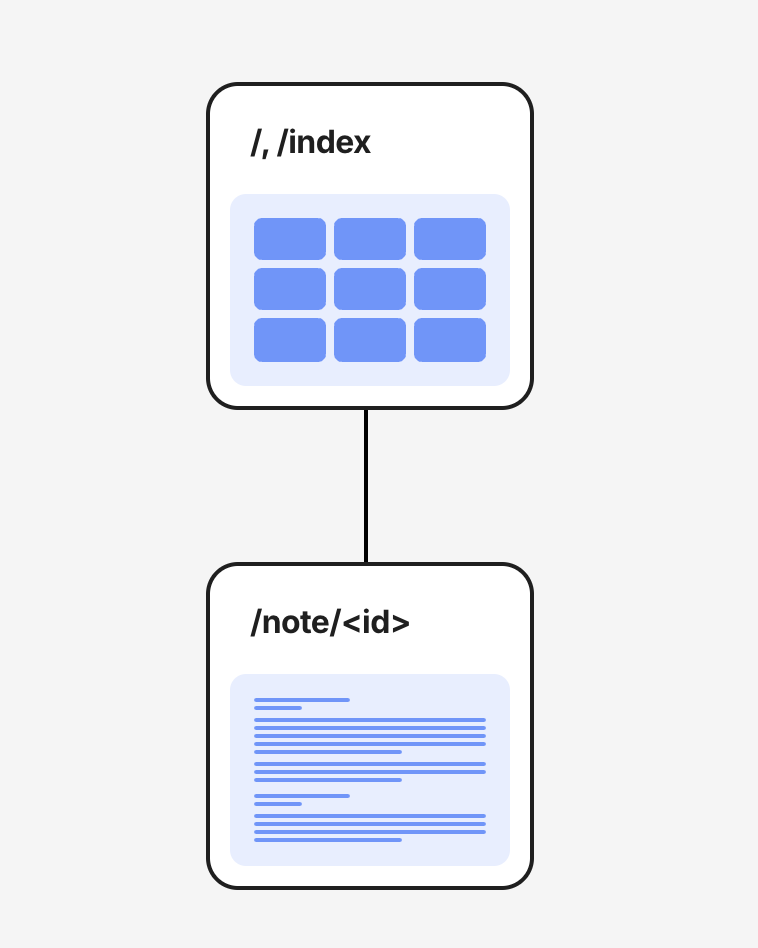
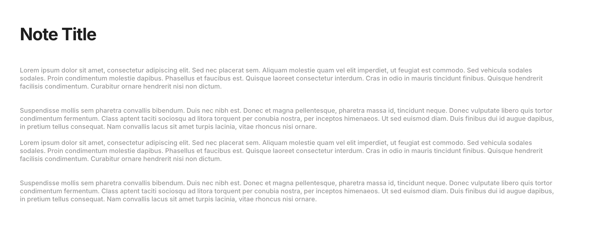

# Milestone 1: Project Proposal
👤 Owen Mount

📚 CST-391: JavaScript Web Application Development

🏷️ ONotes

## Introduction
ONotes is a lightweight plain-text notes app that supports some simple organization features. ONotes uses an express backend API paired with React and Angular frontends to access a MySQL database.

## Functionality Requirements
- [ ] As a user, I want to create a new note so that I can jot down information.
- [ ] As a user, I want to edit an existing note so that I can update my information.
- [ ] As a user, I want to delete a note so that I can remove information I no longer need.
- [ ] As a user, I want to organize my notes into folders or categories so that I can find them easily.
- [ ] As a user, I want to add tags to my notes so that I can filter and search them efficiently.
- [ ] As a user, I want a dark mode option so that I can reduce eye strain in low-light environments.

## Design

*Database ER diagram*

---

*UML Class Diagram*

---

*UI Sitemap*

---

*Wireframe: All notes display*

---

*Wireframe: Note detail display*

## Risks
- Data loss
- Data security
- Scalability
