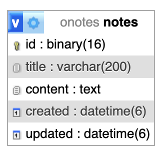
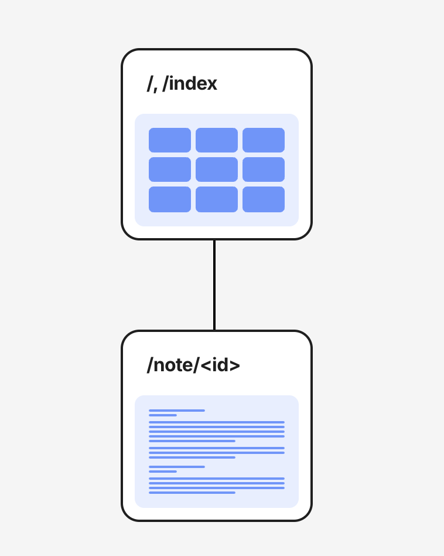
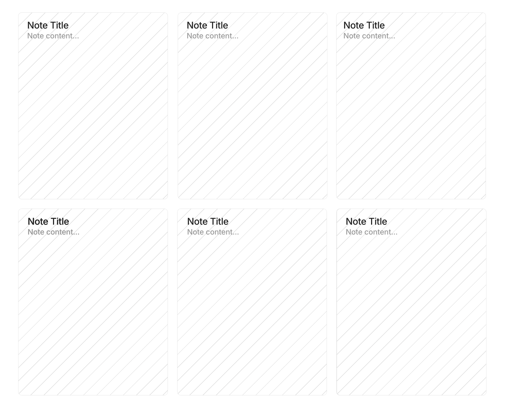
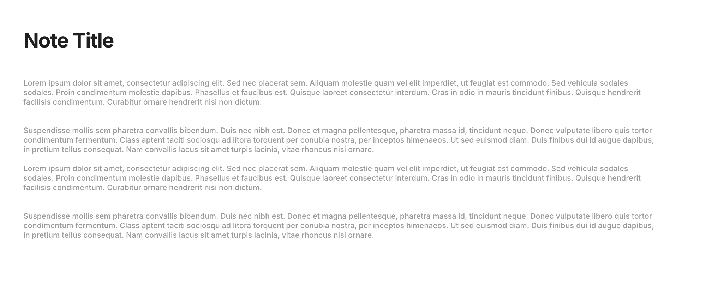

# Milestone 2: Revised Project Proposal
👤 Owen Mount

📚 CST-391: JavaScript Web Application Development

🏷️ ONotes

## Introduction
ONotes is a lightweight plain-text notes app that supports some simple organization features. ONotes uses an express backend API paired with React and Angular frontends to access a MySQL database.

## Instructor Feedback
> Owen, outstanding work on this assignment, keep doing well

I will keep doing well :)

## REST API Documentation

> Version 1.0.0

API for managing notes

### Path Table

| Method | Path                          | Description         |
|--------|-------------------------------|---------------------|
| GET    | [/notes](#getnotes)           | Get all notes       |
| POST   | [/notes](#postnotes)          | Create a new note   |
| GET    | [/notes/{id}](#getnotesid)    | Get a note by ID    |
| PUT    | [/notes/{id}](#putnotesid)    | Update a note by ID |
| DELETE | [/notes/{id}](#deletenotesid) | Delete a note by ID |

### Reference Table

| Name | Path                                                | Description |
|------|-----------------------------------------------------|-------------|
| Note | [#/components/schemas/Note](#componentsschemasnote) |             |

### Path Details

***

### [GET]/notes

- Summary  
  Get all notes

#### Responses

- 200 A list of notes

`application/json`

```ts
{
  id?: string
  title?: string
  content?: string
  created?: string
  updated?: string
}
```

***

### [POST]/notes

- Summary  
  Create a new note

#### RequestBody

- application/json

```ts
{
  id?: string
  title?: string
  content?: string
  created?: string
  updated?: string
}
```

#### Responses

- 201 Note created

`application/json`

```ts
{
  id?: string
  title?: string
  content?: string
  created?: string
  updated?: string
}
```

***

### [GET]/notes/{id}

- Summary  
  Get a note by ID

#### Responses

- 200 The requested note

`application/json`

```ts
{
  id?: string
  title?: string
  content?: string
  created?: string
  updated?: string
}
```

- 404 Note not found

***

### [PUT]/notes/{id}

- Summary  
  Update a note by ID

#### RequestBody

- application/json

```ts
{
  id?: string
  title?: string
  content?: string
  created?: string
  updated?: string
}
```

#### Responses

- 200 Note updated

`application/json`

```ts
{
  id?: string
  title?: string
  content?: string
  created?: string
  updated?: string
}
```

- 404 Note not found

***

### [DELETE]/notes/{id}

- Summary  
  Delete a note by ID

#### Responses

- 204 Note deleted

- 404 Note not found

### References

### #/components/schemas/Note

```ts
{
  id?: string
  title?: string
  content?: string
  created?: string
  updated?: string
}
```

## Functionality Requirements
- [ ] As a user, I want to create a new note so that I can jot down information.
- [ ] As a user, I want to edit an existing note so that I can update my information.
- [ ] As a user, I want to delete a note so that I can remove information I no longer need.
- [ ] As a user, I want to organize my notes into folders or categories so that I can find them easily.
- [ ] As a user, I want to add tags to my notes so that I can filter and search them efficiently.
- [ ] As a user, I want a dark mode option so that I can reduce eye strain in low-light environments.

## Design


*Database ER diagram*

---


*UML Class Diagram*

---



*UI Sitemap*

---



*Wireframe: All notes display*

---



*Wireframe: Note detail display*

## Risks
- Data loss
- Data security
- Scalability
