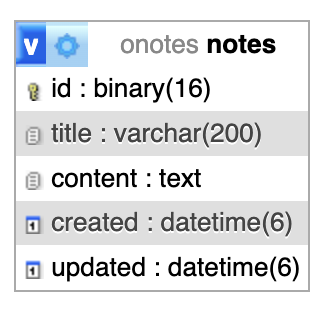
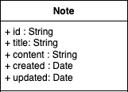
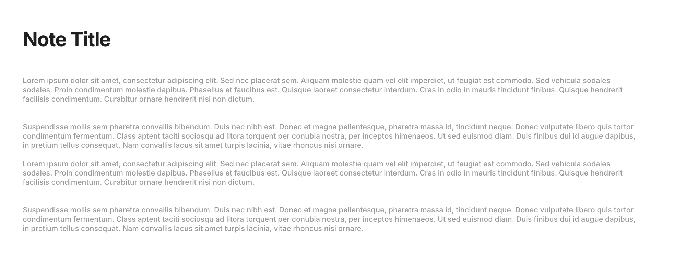

# Milestone 5: React Front-End
👤 Owen Mount

📚 CST-391: JavaScript Web Application Development

🏷️ ONotes

📺 [Screencast](https://mygcuedu6961-my.sharepoint.com/:v:/g/personal/omount_my_gcu_edu/Ec-Ry4CYHexHnMQfoq26vR0BKcP-nlhEgCHKS7APdlkfBA?e=MN6S0a&nav=eyJyZWZlcnJhbEluZm8iOnsicmVmZXJyYWxBcHAiOiJTdHJlYW1XZWJBcHAiLCJyZWZlcnJhbFZpZXciOiJTaGFyZURpYWxvZy1MaW5rIiwicmVmZXJyYWxBcHBQbGF0Zm9ybSI6IldlYiIsInJlZmVycmFsTW9kZSI6InZpZXcifX0%3D)

🪧 [Presentation](milestone5.pdf)

## Introduction
ONotes is a lightweight plain-text notes app that supports some simple organization features. ONotes uses an express backend API paired with React and Angular frontends to access a MySQL database.

## Design Updates
- Migrated from Bootstrap-based UI to a TailwindCSS-based UI.

### Changes
- More robust markdown parsing added.

### Issues
- Note display design should be more responsive.

## Functionality Requirements
- [x] As a user, I want to create a new note so that I can jot down information.
- [x] As a user, I want to edit an existing note so that I can update my information.
- [x] As a user, I want to delete a note so that I can remove information I no longer need.

## Design


*Database ER diagram*

---



*UML Class Diagram*

---


*UI Sitemap*

---


*Wireframe: All notes display*

---



*Wireframe: Note detail display*

## Risks
- Data loss
- Data security
- Scalability

## [REST API Documentation](api.yaml)

> Version 1.0.0

Lightweight plain-text notes app

### Path Table

| Method | Path                                      | Description     |
|--------|-------------------------------------------|-----------------|
| GET    | [/notes](#getnotes)                       | Read all notes  |
| POST   | [/notes](#postnotes)                      | Create new note |
| PUT    | [/notes](#putnotes)                       | Update note     |
| GET    | [/notes/{noteUuid}](#getnotesnoteuuid)    | Read a note     |
| DELETE | [/notes/{noteUuid}](#deletenotesnoteuuid) | Delere a note   |

### Reference Table

| Name           | Path                                                                    | Description                  |
|----------------|-------------------------------------------------------------------------|------------------------------|
| NoteUuid       | [#/components/schemas/NoteUuid](#componentsschemasnoteuuid)             | UUID of note                 |
| DateTime       | [#/components/schemas/DateTime](#componentsschemasdatetime)             | Date and time for timestamps |
| Note           | [#/components/schemas/Note](#componentsschemasnote)                     |                              |
| OkPacket       | [#/components/schemas/OkPacket](#componentsschemasokpacket)             |                              |
| ResponsePacket | [#/components/schemas/ResponsePacket](#componentsschemasresponsepacket) |                              |
| Error          | [#/components/schemas/Error](#componentsschemaserror)                   |                              |
| ApiKey         | [#/components/securitySchemes/ApiKey](#componentssecurityschemesapikey) |                              |

### Path Details

***

### [GET]/notes

- Summary
  Read all notes

#### Responses

- 200 Array of all notes

`application/json`

```ts
{
  // UUID of note
  id: string
  title: string
  content: string
  // Date and time for timestamps
  created?: string
  updated:#/components/schemas/DateTime
}[]
```

- 500 Internal server error

`application/json`

```ts
{
  // A human readable error message
  message: string
}
```

***

### [POST]/notes

- Summary
  Create new note

#### RequestBody

- application/json

```ts
{
  // UUID of note
  id: string
  title: string
  content: string
  // Date and time for timestamps
  created?: string
  updated:#/components/schemas/DateTime
}
```

#### Responses

- 200 Response showing successful creation

`application/json`

```ts
{
  fieldCount?: number
  affectedRows?: number
  insertId?: number
  serverStatus?: number
  warningCount?: number
  message?: string
  protocol41?: boolean
  changedRows?: number
}
```

- 500 Internal server error

`application/json`

```ts
{
  // A human readable error message
  message: string
}
```

***

### [PUT]/notes

- Summary
  Update note

#### RequestBody

- application/json

```ts
{
  // UUID of note
  id: string
  title: string
  content: string
  // Date and time for timestamps
  created?: string
  updated:#/components/schemas/DateTime
}
```

#### Responses

- 200 Response showing successful update

`application/json`

```ts
{
  // UUID of note
  id: string
  title: string
  content: string
  // Date and time for timestamps
  created?: string
  updated:#/components/schemas/DateTime
}[]
```

- 500 Internal server error

`application/json`

```ts
{
  // A human readable error message
  message: string
}
```

***

### [GET]/notes/{noteUuid}

- Summary
  Read a note

#### Responses

- 200 Note object

`application/json`

```ts
{
  // UUID of note
  id: string
  title: string
  content: string
  // Date and time for timestamps
  created?: string
  updated:#/components/schemas/DateTime
}
```

- 500 Internal server error

`application/json`

```ts
{
  // A human readable error message
  message: string
}
```

***

### [DELETE]/notes/{noteUuid}

- Summary
  Delete a note

#### Responses

- 200 Response showing successful delete

`application/json`

```ts
{
  // UUID of note
  id: string
  title: string
  content: string
  // Date and time for timestamps
  created?: string
  updated:#/components/schemas/DateTime
}[]
```

- 500 Internal server error

`application/json`

```ts
{
  // A human readable error message
  message: string
}
```

## References

### #/components/schemas/NoteUuid

```ts
{
  "description": "UUID of note",
  "type": "string"
}
```

### #/components/schemas/DateTime

```ts
{
  "description": "Date and time for timestamps",
  "type": "string"
}
```

### #/components/schemas/Note

```ts
{
  // UUID of note
  id: string
  title: string
  content: string
  // Date and time for timestamps
  created?: string
  updated:#/components/schemas/DateTime
}
```

### #/components/schemas/OkPacket

```ts
{
  fieldCount?: number
  affectedRows?: number
  insertId?: number
  serverStatus?: number
  warningCount?: number
  message?: string
  protocol41?: boolean
  changedRows?: number
}
```

### #/components/schemas/ResponsePacket

```ts
{
  okPacket: {
    fieldCount?: number
    affectedRows?: number
    insertId?: number
    serverStatus?: number
    warningCount?: number
    message?: string
    protocol41?: boolean
    changedRows?: number
  }
  // UUID of note
  lastInsertId?: string
}
```

### #/components/schemas/Error

```ts
{
  // A human readable error message
  message: string
}
```

### #/components/securitySchemes/ApiKey

```ts
{
  "type": "apiKey",
          "in": "header",
          "name": "X-Api-Key"
}
```
